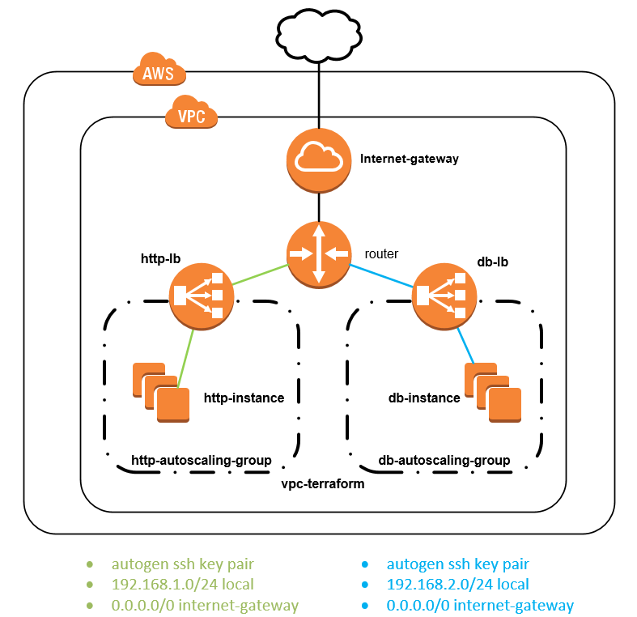

# How to



Provide a stack with autoscaling group, only redeploy instance when the service is down or user manualy scale-up/down instances

### Create stack

```
terraform apply
```

This script will create:
-   1 vpc
-   2 subnet
-   2 instance htt
-   3 instance db
-   2 load balancer
-   2 autoscaling group

### Delete stack

```
terraform destroy
```
